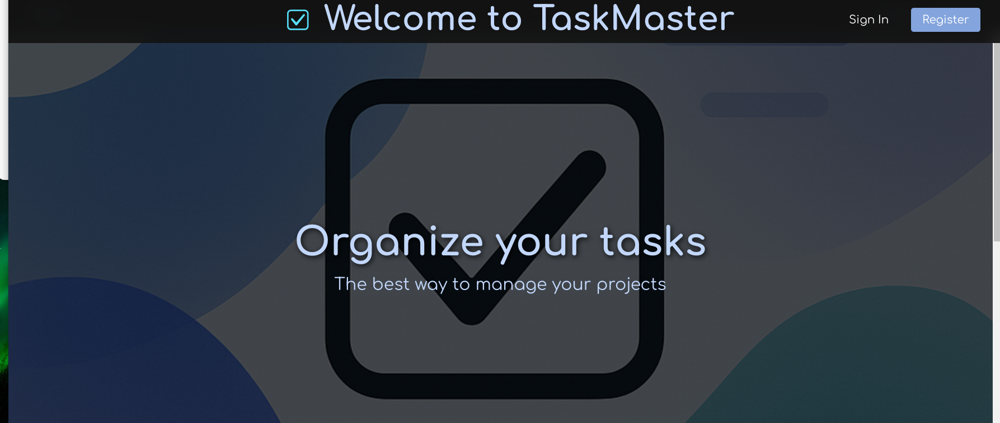
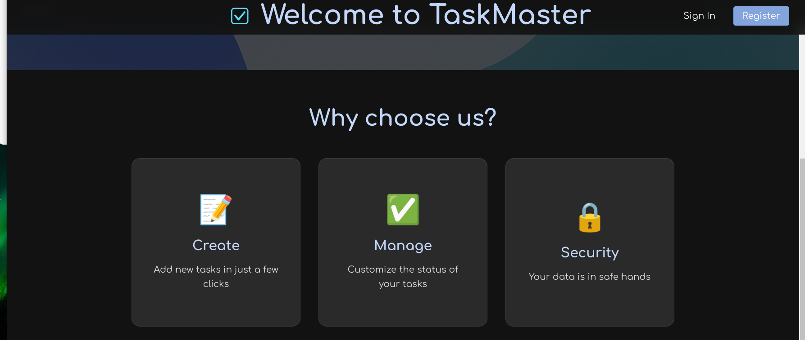
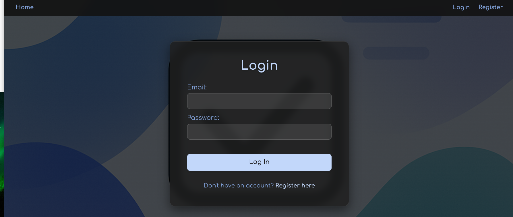
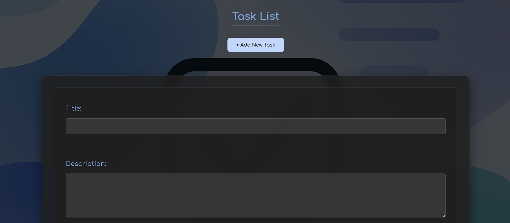

# TaskMaster - Task Management Application


TaskMaster is a modern web application for task management with user authentication, allowing you to organize your daily tasks in a simple and intuitive way.     

<p align="center">
  
  <br>
  <em>Fig 1. TaskMaster dashboard showing task cards and filters</em>
</p>


## ✨ Features

- **User registration and login**
- **CRUD operations for tasks** (Create, Read, Update, Delete)
- **Interactive task list** with status indicators (In Progress/Completed)
- **Responsive design** that works on all devices
- **Data privacy** - each user sees only their own tasks
- **Animations and modern UI components** for better user experience     


<p align="center">
  
  <br>
  <em>Fig 2. Home Page</em>
</p>     


<p align="center">
  
  <br>
  <em>Fig 3. Login Page</em>
</p>


<p align="center">
  
  <br>
  <em>Fig 4. Add Task </em>
</p>

## 🛠 Technologies    

- **Backend**:
  - bcrypt for password hashing
  - JWT (JSON Web Tokens) for authentication
  - LocalStorage for data persistence

- **Frontend**:
  - React.js
  - Vite
  - React Router
  - Context API for state management
  - CSS3 with modern effects (blur, transitions)
  - Animate.css for animations


## 🚨 Important Setup Order
Backend server MUST be running before the frontend application!

### Backend Setup

1. Installation

```bash
git clone https://github.com/zwezdica/task_master_backend.git
cd task_master_backend
npm install
```

2. Configuration
Create .env file:

```env
MONGO_URI=mongodb://localhost:27017/to_do
JWT_SECRET=your_strong_secret_here
PORT=5000
```

3. Running the Server

```bash
npm start
```

## Frontend 
### 🚀 Getting Started

1. Clone the repository:
   ```bash
   git clone https://github.com/zwezdica/task_master_react.git

2. Install dependencies:
   ```bash
   cd task_master_react
   npm install

3. Start the development server:
   ```bash
   npm run dev

4. Open your browser and visit:
   ```bash
   http://localhost:5000


## 📂 Project Structure

TASK_MASTER_REACT/    
├── .vscode/                                                               
├── node_modules/                                                         
├── public/                                                               
│ └── vite.svg    
├── src/    
│ ├── assets/                                                             
│ │ ├── background.jpg    
│ │ ├── logo.png    
│ │ └── react.svg    
│ ├── components/                                                         
│ │ ├── Home.jsx    
│ │ ├── LoginForm.jsx    
│ │ ├── Navbar.jsx    
│ │ ├── RegisterForm.jsx    
│ │ ├── TaskForm.jsx    
│ │ ├── TaskList.jsx    
│ │ └── TasksPage.jsx    
│ ├── context/                                                             
│ │ ├── AuthContext.jsx        
│ │ └── AuthProvider.jsx    
│ ├── styles/                                                             
│ │ ├── Home.css    
│ │ ├── LoginForm.css    
│ │ ├── RegisterForm.css    
│ │ ├── TaskForm.css    
│ │ ├── TaskList.css    
│ │ ├── TasksPage.css    
│ │ └── App.css    
│ ├── App.jsx                                                               
│ ├── index.css                                                              
│ └── main.jsx                                                               
├── .gitignore                                                               
├── eslint.config.js                                                         
├── index.html                                                              
├── package.json                                                            
├── package-lock.json                                                        
├── vite.config.js                                                           
└── README.md                                                                


## 🌟 Key Benefits

✅ Modern design - Dark theme with blue accents

✅ Fast and responsive - Optimized with Vite bundler

✅ Open source - Feel free to contribute or fork the project


## 🤝 Contributions

Pull requests are welcome! For major changes, please open an issue first to discuss what you'd like to change.


